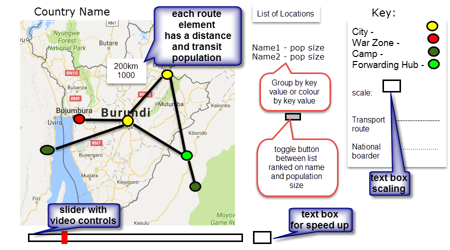

# Visualflee

## Overview

FLEE, an agent model based simulation tool, developed by Groen (2016) at Brunel University London. It uses data from [United Nations High Commission for Refugees](http://data2.unhcr.org/en/situations) (UNHCR) about camps and data from the [Armed Conflict Location & Event Data Project](http://data2.unhcr.org/en/situations) (ACLED) to model the migration of refugees within a conflict zone. This project aims to automate the data acquisition that is used as the inputs to Flee and visualise the outputs of FLEE. Currently, FLEE is closed source but it will be soon be made available (after the first journal paper publication) under a BSD 2-clause license.

Initially, this will be of benefit as a research project but, if accurate, it could be of help for governmental and non-governmental organisations to manage refugees escaping conflict zones. The project can be divided into three major components:

* data acquisition
* refugee movement simulation
* visualisation of the results

Currently, these aspects are decoupled but the ultimate aim is to produce a tightly coupled application of the type that would allow the migration of refugees to be modelled in real time:

## Data acquisition

The migration application uses data from two main sources:

* UNHCR data about camps.
* ACLED information about conflict location and times.

As a result of this project an R package, [runchr](https://github.com/AndySouth/runhcr), is being 
developed to extract data from the UN. It was thought to create a new separate repository for this
as it was envisaged that such a framework might be of use to a more general audience than just for
this project. 

For the ACLED data the use of their [API](http://www.acleddata.com/wp-content/uploads/2017/03/API-User-Guide_March-2017.pdf) was investigated. A query was developed that returns the data required which could still do with a 
little bit more filtering.

## Simulation of refugee movements

Acquired data from 3 different publicly available sources provide an input for running an agent-based simulation. It uses FLEE code for predicting refugee movements and produces output numbers of the population for cities and camps over the simulation period. An introductory paper on simulating refugee movements is written by [Groen (2016)](http://www.sciencedirect.com/science/article/pii/S1877050916308766) with a description of parameters, assumptions and application to crisis situation of Mali. FLEE simulation model has also been applied to Burundi, Central African Republic and South Sudan, which is in a publication progress.

## Visualisation

We set out to visualise the movement of people during a conflict on a map,
with circles which grow and shrink as the population in each location changes.
The colours of the circles distinguish cities, conflict zones and refugee camps.

Python code combines the CSV data describing geographical locations and how
their population changed through time, and produces data in the standard GeoJSON
format. The visualisation itself is created in HTML and Javascript, using the
popular [Leafletjs](http://leafletjs.com/) library to display maps, and the
[Leaflet.timeline](http://skeate.github.io/Leaflet.timeline/) plugin to animate
them.

To show the visualisation:

1. Run ``python map_camps_timehistory.py`` to process the data.
2. Open flight.html in a browser.

Extensions to this could include:
- Adding a more explicit display of movement on the map, to show where the
  swelling population in a refugee camp is coming from.
- Interactive controls for e.g. the scaling factor of the markers.
- More automation, e.g. to automatically set the starting point of the map based
  on the data.
